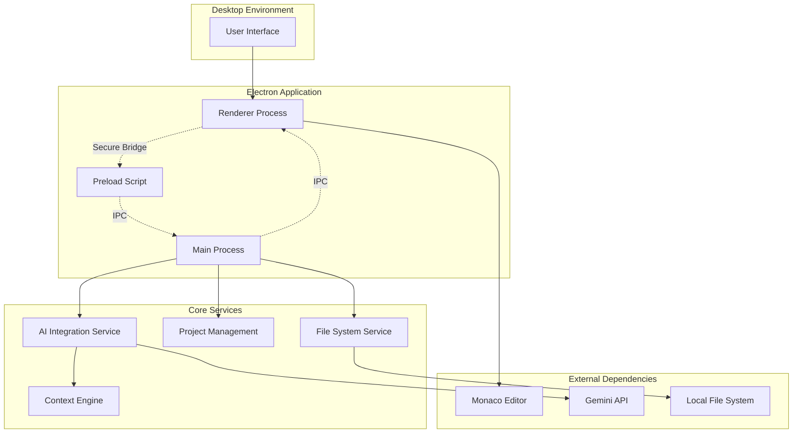

# Design Document: AI-Powered IDE

## Overview

This design document outlines the architecture for a revolutionary AI-powered desktop IDE that prioritizes ease of use while providing comprehensive development capabilities. The system leverages Electron for cross-platform desktop deployment, Monaco Editor for advanced code editing, and Google's Gemini API for intelligent assistance. The architecture emphasizes security, performance, and user experience while addressing common limitations found in existing IDEs.

The IDE differentiates itself through intuitive AI integration, comprehensive feature set, and superior user experience. Key innovations include seamless AI-traditional IDE integration, intelligent context management, and performance optimizations that maintain responsiveness even with large codebases.

## Architecture

### High-Level Architecture

The application follows Electron's multi-process architecture with enhanced security and performance considerations:



### Process Architecture

**Main Process Responsibilities:**
- Application lifecycle management
- Native menu and dialog handling
- File system operations
- AI API communication
- Security enforcement
- Window management

**Renderer Process Responsibilities:**
- User interface rendering
- Monaco Editor integration
- User interaction handling
- UI state management
- Real-time editor updates

**Preload Script Responsibilities:**
- Secure IPC bridge between processes
- API exposure to renderer with security validation
- Context isolation enforcement

## Components and Interfaces

### Core Components

#### 1. Application Shell (Main Process)

```typescript
interface ApplicationShell {
  initialize(): Promise<void>;
  createWindow(): BrowserWindow;
  setupMenus(): void;
  handleAppEvents(): void;
  shutdown(): Promise<void>;
}

interface IPCHandler {
  registerHandlers(): void;
  handleFileOperations(event: IpcMainEvent, operation: FileOperation): Promise<any>;
  handleAIRequests(event: IpcMainEvent, request: AIRequest): Promise<any>;
  handleProjectOperations(event: IpcMainEvent, operation: ProjectOperation): Promise<any>;
}
```

#### 2. Editor Integration (Renderer Process)

```typescript
interface EditorManager {
  initializeMonaco(): Promise<void>;
  createEditor(container: HTMLElement): monaco.editor.IStandaloneCodeEditor;
  setupLanguageSupport(): void;
  registerCommands(): void;
  handleFileChanges(file: FileInfo): void;
}

interface TabManager {
  openFile(filePath: string): Promise<Tab>;
  closeTab(tabId: string): void;
  switchTab(tabId: string): void;
  getActiveTab(): Tab | null;
  getAllTabs(): Tab[];
}
```

#### 3. File System Service

```typescript
interface FileSystemService {
  readFile(path: string): Promise<string>;
  writeFile(path: string, content: string): Promise<void>;
  watchDirectory(path: string): FileWatcher;
  getProjectStructure(rootPath: string): Promise<ProjectTree>;
  searchFiles(query: string, rootPath: string): Promise<SearchResult[]>;
}

interface ProjectExplorer {
  loadProject(rootPath: string): Promise<void>;
  refreshTree(): Promise<void>;
  createFile(path: string): Promise<void>;
  deleteFile(path: string): Promise<void>;
  renameFile(oldPath: string, newPath: string): Promise<void>;
}
```

#### 4. AI Integration Service

```typescript
interface AIService {
  initialize(apiKey: string): Promise<void>;
  generateCompletion(context: CodeContext): Promise<CompletionResult>;
  editCode(instruction: string, code: string): Promise<EditResult>;
  explainCode(code: string): Promise<ExplanationResult>;
  chatWithAI(message: string, context: ProjectContext): Promise<ChatResponse>;
}

interface ContextEngine {
  collectProjectContext(rootPath: string): Promise<ProjectContext>;
  getRelevantFiles(currentFile: string): Promise<string[]>;
  updateContext(changes: FileChange[]): Promise<void>;
  optimizeContext(maxTokens: number): ProjectContext;
}
```

#### 5. Comprehensive IDE Features

```typescript
interface TerminalService {
  createTerminal(workingDirectory: string): Terminal;
  executeCommand(command: string, terminal: Terminal): Promise<CommandResult>;
  getTerminalHistory(terminalId: string): string[];
}

interface GitIntegration {
  initRepository(path: string): Promise<void>;
  getStatus(): Promise<GitStatus>;
  stageFiles(files: string[]): Promise<void>;
  commit(message: string): Promise<void>;
  showDiff(file: string): Promise<DiffResult>;
}

interface DebugService {
  startDebugging(config: DebugConfig): Promise<DebugSession>;
  setBreakpoint(file: string, line: number): Promise<void>;
  stepOver(): Promise<void>;
  inspectVariable(name: string): Promise<VariableInfo>;
}
```

### Interface Specifications

#### Data Models

```typescript
interface FileInfo {
  path: string;
  name: string;
  extension: string;
  size: number;
  lastModified: Date;
  content?: string;
}

interface Tab {
  id: string;
  filePath: string;
  fileName: string;
  isDirty: boolean;
  isActive: boolean;
  language: string;
}

interface ProjectContext {
  rootPath: string;
  files: FileInfo[];
  dependencies: Dependency[];
  summary: string;
  tokenCount: number;
}

interface AIRequest {
  type: 'completion' | 'edit' | 'explain' | 'chat';
  payload: any;
  context: CodeContext;
}

interface CodeContext {
  currentFile: string;
  selectedText?: string;
  cursorPosition: Position;
  surroundingCode: string;
  projectContext: ProjectContext;
}
```

## Data Models

### Core Data Structures

#### Project Model
```typescript
interface Project {
  id: string;
  name: string;
  rootPath: string;
  type: ProjectType;
  configuration: ProjectConfig;
  recentFiles: string[];
  bookmarks: Bookmark[];
  settings: ProjectSettings;
}

interface ProjectConfig {
  language: string;
  framework?: string;
  buildTool?: string;
  testFramework?: string;
  linting: LintingConfig;
  formatting: FormattingConfig;
}
```

#### Editor State Model
```typescript
interface EditorState {
  openTabs: Tab[];
  activeTabId: string;
  splitLayout: SplitLayout;
  cursorPositions: Map<string, Position>;
  selections: Map<string, Selection[]>;
  foldingStates: Map<string, FoldingRange[]>;
}

interface WorkspaceState {
  projects: Project[];
  activeProjectId: string;
  windowLayout: WindowLayout;
  panelStates: PanelState[];
  preferences: UserPreferences;
}
```

#### AI Context Model
```typescript
interface AIContext {
  projectSummary: string;
  relevantFiles: FileContext[];
  currentTask: string;
  conversationHistory: ChatMessage[];
  codeAnalysis: CodeAnalysis;
}

interface FileContext {
  path: string;
  summary: string;
  exports: Symbol[];
  imports: Import[];
  functions: FunctionSignature[];
  classes: ClassDefinition[];
}
```

### Data Persistence

**Local Storage Strategy:**
- Project configurations stored in `.ide-config` directory
- User preferences in system-specific config directories
- AI context cache in temporary storage with cleanup
- File watchers for real-time synchronization

**Performance Optimizations:**
- Lazy loading of file contents
- Virtual scrolling for large file lists
- Incremental context updates
- Background indexing of project symbols

## Correctness Properties

*A property is a characteristic or behavior that should hold true across all valid executions of a system—essentially, a formal statement about what the system should do. Properties serve as the bridge between human-readable specifications and machine-verifiable correctness guarantees.*

Let me analyze the acceptance criteria to determine which ones can be tested as properties:

<function_calls>
<invoke name="prework">
<parameter name="featureName">ai-powered-ide