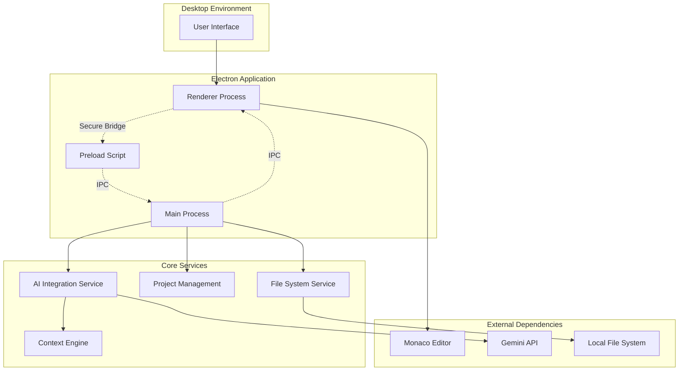

# Design Document: AI-Powered IDE

## Overview

This design document outlines the architecture for a revolutionary AI-powered desktop IDE that prioritizes ease of use while providing comprehensive development capabilities. The system leverages Electron for cross-platform desktop deployment, Monaco Editor for advanced code editing, and Google's Gemini API for intelligent assistance. The architecture emphasizes security, performance, and user experience while addressing common limitations found in existing IDEs.

The IDE differentiates itself through intuitive AI integration, comprehensive feature set, and superior user experience. Key innovations include seamless AI-traditional IDE integration, intelligent context management, and performance optimizations that maintain responsiveness even with large codebases.

## Architecture

### High-Level Architecture

The application follows Electron's multi-process architecture with enhanced security and performance considerations:



### Process Architecture

**Main Process Responsibilities:**
- Application lifecycle management
- Native menu and dialog handling
- File system operations
- AI API communication
- Security enforcement
- Window management

**Renderer Process Responsibilities:**
- User interface rendering
- Monaco Editor integration
- User interaction handling
- UI state management
- Real-time editor updates

**Preload Script Responsibilities:**
- Secure IPC bridge between processes
- API exposure to renderer with security validation
- Context isolation enforcement

## Components and Interfaces

### Core Components

#### 1. Application Shell (Main Process)

```typescript
interface ApplicationShell {
  initialize(): Promise<void>;
  createWindow(): BrowserWindow;
  setupMenus(): void;
  handleAppEvents(): void;
  shutdown(): Promise<void>;
}

interface IPCHandler {
  registerHandlers(): void;
  handleFileOperations(event: IpcMainEvent, operation: FileOperation): Promise<any>;
  handleAIRequests(event: IpcMainEvent, request: AIRequest): Promise<any>;
  handleProjectOperations(event: IpcMainEvent, operation: ProjectOperation): Promise<any>;
}
```

#### 2. Editor Integration (Renderer Process)

```typescript
interface EditorManager {
  initializeMonaco(): Promise<void>;
  createEditor(container: HTMLElement): monaco.editor.IStandaloneCodeEditor;
  setupLanguageSupport(): void;
  registerCommands(): void;
  handleFileChanges(file: FileInfo): void;
}

interface TabManager {
  openFile(filePath: string): Promise<Tab>;
  closeTab(tabId: string): void;
  switchTab(tabId: string): void;
  getActiveTab(): Tab | null;
  getAllTabs(): Tab[];
}
```

#### 3. File System Service

```typescript
interface FileSystemService {
  readFile(path: string): Promise<string>;
  writeFile(path: string, content: string): Promise<void>;
  watchDirectory(path: string): FileWatcher;
  getProjectStructure(rootPath: string): Promise<ProjectTree>;
  searchFiles(query: string, rootPath: string): Promise<SearchResult[]>;
}

interface ProjectExplorer {
  loadProject(rootPath: string): Promise<void>;
  refreshTree(): Promise<void>;
  createFile(path: string): Promise<void>;
  deleteFile(path: string): Promise<void>;
  renameFile(oldPath: string, newPath: string): Promise<void>;
}
```

#### 4. AI Integration Service

```typescript
interface AIService {
  initialize(apiKey: string): Promise<void>;
  generateCompletion(context: CodeContext): Promise<CompletionResult>;
  editCode(instruction: string, code: string): Promise<EditResult>;
  explainCode(code: string): Promise<ExplanationResult>;
  chatWithAI(message: string, context: ProjectContext): Promise<ChatResponse>;
}

interface ContextEngine {
  collectProjectContext(rootPath: string): Promise<ProjectContext>;
  getRelevantFiles(currentFile: string): Promise<string[]>;
  updateContext(changes: FileChange[]): Promise<void>;
  optimizeContext(maxTokens: number): ProjectContext;
}
```

#### 5. Comprehensive IDE Features

```typescript
interface TerminalService {
  createTerminal(workingDirectory: string): Terminal;
  executeCommand(command: string, terminal: Terminal): Promise<CommandResult>;
  getTerminalHistory(terminalId: string): string[];
}

interface GitIntegration {
  initRepository(path: string): Promise<void>;
  getStatus(): Promise<GitStatus>;
  stageFiles(files: string[]): Promise<void>;
  commit(message: string): Promise<void>;
  showDiff(file: string): Promise<DiffResult>;
}

interface DebugService {
  startDebugging(config: DebugConfig): Promise<DebugSession>;
  setBreakpoint(file: string, line: number): Promise<void>;
  stepOver(): Promise<void>;
  inspectVariable(name: string): Promise<VariableInfo>;
}
```

### Interface Specifications

#### Data Models

```typescript
interface FileInfo {
  path: string;
  name: string;
  extension: string;
  size: number;
  lastModified: Date;
  content?: string;
}

interface Tab {
  id: string;
  filePath: string;
  fileName: string;
  isDirty: boolean;
  isActive: boolean;
  language: string;
}

interface ProjectContext {
  rootPath: string;
  files: FileInfo[];
  dependencies: Dependency[];
  summary: string;
  tokenCount: number;
}

interface AIRequest {
  type: 'completion' | 'edit' | 'explain' | 'chat';
  payload: any;
  context: CodeContext;
}

interface CodeContext {
  currentFile: string;
  selectedText?: string;
  cursorPosition: Position;
  surroundingCode: string;
  projectContext: ProjectContext;
}
```

## Data Models

### Core Data Structures

#### Project Model
```typescript
interface Project {
  id: string;
  name: string;
  rootPath: string;
  type: ProjectType;
  configuration: ProjectConfig;
  recentFiles: string[];
  bookmarks: Bookmark[];
  settings: ProjectSettings;
}

interface ProjectConfig {
  language: string;
  framework?: string;
  buildTool?: string;
  testFramework?: string;
  linting: LintingConfig;
  formatting: FormattingConfig;
}
```

#### Editor State Model
```typescript
interface EditorState {
  openTabs: Tab[];
  activeTabId: string;
  splitLayout: SplitLayout;
  cursorPositions: Map<string, Position>;
  selections: Map<string, Selection[]>;
  foldingStates: Map<string, FoldingRange[]>;
}

interface WorkspaceState {
  projects: Project[];
  activeProjectId: string;
  windowLayout: WindowLayout;
  panelStates: PanelState[];
  preferences: UserPreferences;
}
```

#### AI Context Model
```typescript
interface AIContext {
  projectSummary: string;
  relevantFiles: FileContext[];
  currentTask: string;
  conversationHistory: ChatMessage[];
  codeAnalysis: CodeAnalysis;
}

interface FileContext {
  path: string;
  summary: string;
  exports: Symbol[];
  imports: Import[];
  functions: FunctionSignature[];
  classes: ClassDefinition[];
}
```

### Data Persistence

**Local Storage Strategy:**
- Project configurations stored in `.ide-config` directory
- User preferences in system-specific config directories
- AI context cache in temporary storage with cleanup
- File watchers for real-time synchronization

**Performance Optimizations:**
- Lazy loading of file contents
- Virtual scrolling for large file lists
- Incremental context updates
- Background indexing of project symbols

## Correctness Properties

*A property is a characteristic or behavior that should hold true across all valid executions of a system—essentially, a formal statement about what the system should do. Properties serve as the bridge between human-readable specifications and machine-verifiable correctness guarantees.*

Let me analyze the acceptance criteria to determine which ones can be tested as properties:

<function_calls>
<invoke name="prework">
<parameter name="featureName">ai-powered-ide

Based on the prework analysis, here are the key correctness properties that will ensure the IDE functions reliably:

### Property 1: IPC Security and Communication
*For any* IPC message between main and renderer processes, the preload script should validate the message format and ensure secure communication without exposing sensitive APIs directly to the renderer.
**Validates: Requirements 1.3**

### Property 2: Resource Cleanup on Shutdown
*For any* application shutdown scenario, all resources (file watchers, API connections, temporary files) should be properly cleaned up and application state should be persisted.
**Validates: Requirements 1.5**

### Property 3: File Type Syntax Highlighting
*For any* supported file type, opening the file should result in appropriate syntax highlighting being applied based on the file extension and content.
**Validates: Requirements 2.2**

### Property 4: Tab Management Consistency
*For any* sequence of tab operations (open, close, switch), the active tab state should remain consistent and tab switching should always work correctly.
**Validates: Requirements 2.3, 2.4**

### Property 5: Project Structure Loading
*For any* valid project directory, loading the project should correctly parse and display the complete directory structure in the project explorer.
**Validates: Requirements 2.6**

### Property 6: File System Operation Consistency
*For any* file system operation (read, write, create, delete, rename), the operation should be reflected consistently across the IDE interface and file system watchers should detect external changes.
**Validates: Requirements 3.1, 3.3, 3.5**

### Property 7: Project Explorer Tree Accuracy
*For any* project structure, the hierarchical tree view should accurately represent the actual file system structure and update correctly when changes occur.
**Validates: Requirements 3.2**

### Property 8: Active File State Tracking
*For any* file switching or editing operation, the IDE should correctly track the active file and maintain consistent state across all components.
**Validates: Requirements 3.4**

### Property 9: API Authentication Consistency
*For any* API request to Gemini, the request should use the locally stored API key for authentication and handle authentication failures gracefully.
**Validates: Requirements 4.2**

### Property 10: API Rate Limiting and Error Handling
*For any* sequence of API requests, rate limiting should be enforced correctly and all error conditions should be handled gracefully with appropriate user feedback.
**Validates: Requirements 4.3**

### Property 11: AI Prompt Template Consistency
*For any* AI interaction type (completion, editing, explanation, chat), the system should use the appropriate prompt template consistently.
**Validates: Requirements 4.4**

### Property 12: Real-time Code Completion
*For any* typing event in the editor, if AI completion is enabled, completion suggestions should be generated and displayed appropriately based on the current context.
**Validates: Requirements 5.1**

### Property 13: Natural Language Code Editing
*For any* selected code block and natural language instruction, the AI should be able to process the instruction and generate appropriate code modifications.
**Validates: Requirements 5.2**

### Property 14: Code Explanation Generation
*For any* selected code block, the AI should be able to generate a meaningful explanation of the code's functionality and purpose.
**Validates: Requirements 5.4**

### Property 15: Context Collection and Token Management
*For any* project context collection operation, the collected context should stay within token limits and include all relevant project information without exceeding API constraints.
**Validates: Requirements 6.1, 6.2**

### Property 16: Context Caching and Retrieval
*For any* context caching operation, summaries should be correctly stored to disk and retrieved efficiently, with proper cache invalidation when files change.
**Validates: Requirements 6.3, 6.5**

### Property 17: Dependency Detection and Context
*For any* project with dependencies, the context engine should correctly identify and include relevant dependency information in the project context.
**Validates: Requirements 6.4**

### Property 18: Multi-file Refactoring Consistency
*For any* multi-file refactoring operation, changes should be applied consistently across all affected files while maintaining code integrity and syntax validity.
**Validates: Requirements 7.1, 7.4**

### Property 19: Symbol Renaming Completeness
*For any* symbol renaming operation, all references to the symbol should be correctly identified and updated across the entire project.
**Validates: Requirements 7.2**

### Property 20: AI Change Undo/Redo
*For any* AI-generated code change, the change should be correctly tracked in the undo/redo system and should be reversible without data loss.
**Validates: Requirements 7.3**

### Property 21: Change Scope Calculation
*For any* multi-file refactoring operation, the system should correctly calculate and display the complete scope of changes before applying them.
**Validates: Requirements 7.5**

### Property 22: Native System Integration
*For any* system event requiring user notification, the IDE should display appropriate native dialogs or notifications using the operating system's native UI components.
**Validates: Requirements 8.2**

### Property 23: Token Usage Optimization
*For any* equivalent AI functionality, the system should minimize token usage while maintaining the same level of functionality and accuracy.
**Validates: Requirements 8.4**

### Property 24: Secure API Key Storage
*For any* API key storage operation, keys should be stored using the operating system's secure credential storage mechanisms and never exposed in plain text.
**Validates: Requirements 9.1**

### Property 25: Data Locality Enforcement
*For any* file or project data operation, the system should only access local files and should never initiate cloud synchronization or remote storage operations.
**Validates: Requirements 9.2**

### Property 26: Data Transmission Restriction
*For any* network communication, code or project data should only be transmitted to the configured AI API endpoint and nowhere else.
**Validates: Requirements 9.3**

### Property 27: Code Navigation Accuracy
*For any* code navigation operation (go-to-definition, find-references), the system should correctly identify and navigate to the appropriate code locations.
**Validates: Requirements 11.4**

### Property 28: Cross-file Search and Replace
*For any* search and replace operation across multiple files, all matching instances should be correctly identified and replaced while maintaining file integrity.
**Validates: Requirements 11.5**

### Property 29: Code Formatting and Linting Consistency
*For any* code formatting or linting operation, the system should apply consistent rules and provide accurate feedback based on the configured standards.
**Validates: Requirements 11.7**

### Property 30: Project Template Validity
*For any* project template, the generated project structure should be valid, complete, and immediately usable for development.
**Validates: Requirements 11.8**

### Property 31: Contextual User Guidance
*For any* user interaction context, appropriate tooltips and hints should be displayed to guide the user without being intrusive.
**Validates: Requirements 12.2**

### Property 32: Task Efficiency Shortcuts
*For any* common development task, the system should provide accessible shortcuts or one-click solutions that reduce the number of steps required.
**Validates: Requirements 12.4**

### Property 33: Workspace Layout Persistence
*For any* workspace layout customization, the changes should be correctly saved and restored across application sessions.
**Validates: Requirements 12.6**

### Property 34: Helpful Error Messaging
*For any* error condition, the system should provide clear, actionable error messages that include suggested solutions or next steps.
**Validates: Requirements 12.7**

### Property 35: Startup Performance Consistency
*For any* project size, the IDE should start within acceptable time limits and maintain consistent startup performance.
**Validates: Requirements 13.1**

### Property 36: Memory Management Bounds
*For any* extended usage session, the IDE should maintain memory usage within reasonable bounds and prevent memory leaks that could cause crashes.
**Validates: Requirements 13.3**

### Property 37: Efficient Project Switching
*For any* project switching operation, the switch should complete efficiently while preserving the state of both the previous and new projects.
**Validates: Requirements 13.4**

### Property 38: Cross-platform Behavior Consistency
*For any* IDE functionality, the behavior should be consistent across Windows, Linux, and macOS platforms with only platform-appropriate UI differences.
**Validates: Requirements 13.6**

### Property 39: Large File Performance
*For any* large file (>1MB), the IDE should use virtual scrolling and lazy loading to maintain responsive performance during editing operations.
**Validates: Requirements 13.7**

## Error Handling

### Error Categories and Strategies

**File System Errors:**
- Handle permission denied, file not found, and disk space errors
- Provide user-friendly error messages with suggested actions
- Implement retry mechanisms for transient failures
- Graceful degradation when file watching fails

**AI API Errors:**
- Rate limit exceeded: Queue requests and inform user of delays
- Authentication failures: Prompt for API key re-entry
- Network connectivity issues: Offline mode with cached suggestions
- Invalid responses: Fallback to basic editor functionality

**Application Errors:**
- Unhandled exceptions: Crash reporting with user consent
- Memory issues: Automatic cleanup and user notification
- IPC communication failures: Process restart mechanisms
- Plugin/extension errors: Isolation to prevent system-wide failures

**User Input Errors:**
- Invalid file paths: Path validation and suggestions
- Malformed configurations: Schema validation with helpful messages
- Unsupported file types: Graceful fallback to plain text editing
- Large file handling: Progressive loading with user feedback

### Recovery Mechanisms

**Auto-save and Recovery:**
- Automatic saving of unsaved changes every 30 seconds
- Recovery of unsaved work after unexpected shutdowns
- Version history for critical configuration files
- Backup of project state before major operations

**Graceful Degradation:**
- Continue basic editing when AI features are unavailable
- Fallback to simple syntax highlighting when language servers fail
- Basic file operations when advanced features are disabled
- Offline mode with reduced functionality

## Testing Strategy

### Dual Testing Approach

The IDE will employ both unit testing and property-based testing to ensure comprehensive coverage and reliability:

**Unit Testing Focus:**
- Specific examples of core functionality
- Integration points between Electron processes
- Edge cases in file operations and AI interactions
- Error conditions and recovery scenarios
- Platform-specific behavior verification

**Property-Based Testing Focus:**
- Universal properties that hold across all inputs
- Comprehensive input coverage through randomization
- Validation of correctness properties defined in this document
- Stress testing with generated data sets
- Cross-platform consistency verification

### Property-Based Testing Configuration

**Testing Framework:** 
- **JavaScript/TypeScript:** fast-check library for property-based testing
- **Minimum 100 iterations** per property test to ensure statistical confidence
- **Custom generators** for IDE-specific data types (files, projects, code contexts)

**Test Organization:**
- Each correctness property implemented as a single property-based test
- Tests tagged with feature name and property reference
- Tag format: **Feature: ai-powered-ide, Property {number}: {property_text}**
- Separate test suites for different IDE components

**Example Property Test Structure:**
```typescript
// Feature: ai-powered-ide, Property 6: File System Operation Consistency
fc.assert(fc.property(
  fc.record({
    operation: fc.constantFrom('create', 'delete', 'rename', 'modify'),
    filePath: validFilePathGenerator(),
    content: fc.string()
  }),
  (testData) => {
    // Test that file operations are reflected consistently
    // across IDE interface and file system watchers
  }
), { numRuns: 100 });
```

### Integration Testing Strategy

**Cross-Process Communication:**
- Test IPC message handling between main and renderer processes
- Verify security boundaries and data validation
- Test process recovery and restart scenarios

**AI Integration Testing:**
- Mock Gemini API responses for consistent testing
- Test rate limiting and error handling scenarios
- Verify context collection and token management

**File System Integration:**
- Test with various project structures and file types
- Verify file watching and change detection
- Test performance with large projects and files

**Platform Testing:**
- Automated testing on Windows, Linux, and macOS
- Platform-specific feature testing (native dialogs, shortcuts)
- Performance benchmarking across platforms

### Performance Testing

**Startup Performance:**
- Measure application startup time with various project sizes
- Test memory usage during initialization
- Verify responsive UI during loading

**Runtime Performance:**
- Monitor memory usage during extended sessions
- Test editor responsiveness with large files
- Measure AI response times and optimization

**Scalability Testing:**
- Test with projects containing thousands of files
- Verify performance with multiple open tabs
- Test context collection with large codebases

This comprehensive testing strategy ensures that the AI-powered IDE maintains high quality, reliability, and performance across all supported platforms and use cases.